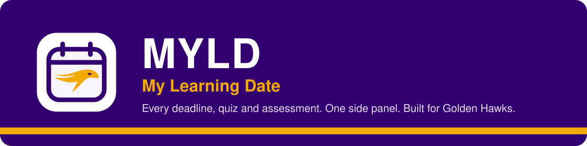

<p>


</p>

**[Why I made this](#-why-i-made-this)** · **[Features](#-features)** · **[Install](#-install)** · **[Pearson & Achieve](#-pearson--achieve)** · **[Privacy](#-privacy)** · **[Status](#-status)** · **[Development](#-development)**

---

## 💜 Why I made this

I'm a double degree student with classes at Laurier. Once the term got going, I realized how much there was to keep track of. There were assignments on MyLearningSpace, quizzes in every course, homework on Pearson and Achieve, and assessments with dates that moved around. Everything lived in a different place, and I kept having to click through each course just to figure out what was due next.

Keeping on top of all of it was something I honestly struggled with. I wanted one place that would tell me what was coming up, without me having to go looking for it.

Then I tried Eric Zou's [WATnow](https://github.com/EricJujianZou/watnow). It does this for Waterloo's Learn, and I wished Laurier had something like it. So I built MYLD, a way to keep myself informed about everything that's due, all in one place.

---

## ✨ Features

| | |
|---|---|
| 📅 **One list for everything** | Assignments, quizzes and assessments from all your classes, sorted into Overdue, Today, This week, Next week, Later and Completed. The nearest deadline sits at the top. |
| 🦅 **One slot per class** | Duplicate MyLearningSpace course shells are merged. You can filter by class, or by source: MyLS, Pearson or Achieve. |
| 📝 **Quiz list** | Every quiz in a class, including ones with no posted due date. |
| ✅ **Real vs. manual completion** | What MyLS, Pearson or Achieve shows as done is kept separate from things you tick off yourself. Ticking something off never submits it. |
| 📊 **Weekly progress** | A gold progress bar for work due Monday to Sunday, for whichever class or source you're looking at. |
| 🔔 **Reminders & moved dates** | MYLD rereads MyLearningSpace every 30 minutes while Chrome is open, flags due dates that changed, and can remind you about each kind of deadline. |
| 🎨 **Laurier look** | Purple, white and gold, with light, dark and system appearance, keyboard controls and reduced motion. |

---

## 🚀 Install

> MYLD isn't on the Chrome Web Store yet, so for now you load it yourself.

1. Click **Code → Download ZIP** on this page and unzip it into your **Documents** folder, or clone the repo there.
2. Go to `chrome://extensions` and turn on **Developer mode** (top right).
3. Click **Load unpacked** and choose the **`extension`** folder (the one with `manifest.json`).
4. Pin MYLD, log in to MyLearningSpace, open the side panel and hit **Sync**.

<details>
<summary><b>Updating to a newer version</b></summary>

Replace the files **in the same folder**, then click **Reload** on the MYLD card in `chrome://extensions`. If you load it from a different folder, Chrome treats it as a separate install with its own saved data, so your check-offs and connections won't carry over.

</details>

---

## 🔗 Pearson & Achieve

Sync MyLearningSpace first, then go to **Settings → Connections** and connect the platform. MYLD reads the assignment pages you have open. It doesn't open courses on its own, doesn't expand or click anything, and never launches or submits anything.

| Platform | Open this page |
|---|---|
| **Pearson MyLab** | Your course → Lab Quizzes and Assignments |
| **Pearson Mastering** | Your course's assignment list *(new, not yet checked on a real account)* |
| **Achieve** | My Course → Assignments (use View All to load more; collapsed and Past Assignments groups already on the page are read too) |

**Completion** comes from the platform itself: Complete, Submitted (including late), Graded, a score, or 100%. An attempt count, "40% complete" progress, or a class-wide "students completed" number never counts. Items without a due date show under **No date listed**.

**When a platform item is also posted on MyLS** (same class, matching title, due within about a day), it shows once, under the platform where you actually do the work, with that platform's status and link, and a note that it's also on MyLS. Titles are matched after removing platform names and noise, so "Achieve – Ch. 4 HW" matches "Chapter 4 Homework". Chapter, quiz, part and week numbers must match exactly, and if a match could go more than one way, nothing is merged. Settings → Sync details lists every merge decision.

Only loaded work is picked up, so the platform is still the final word on deadlines.

---

## 🔒 Privacy

Everything stays in Chrome on your own computer. There's **no MYLD server, no analytics, no password collection and no cookie export**. Requests to MyLearningSpace go through your own signed-in tab and are read-only.

<details>
<summary><b>What each permission is for</b></summary>

| Permission | Why |
|---|---|
| storage, alarms, sidePanel | Saving your list and settings, scheduling syncs and reminders, and showing the side panel |
| mylearningspace.wlu.ca | Reading your courses and deadlines through your signed-in tab (read-only) |
| notifications (optional) | Deadline reminders, only if you turn them on |
| scripting and Pearson/Achieve sites (optional) | Reading assignment lists on pages you've connected |

**Clear local data** in Settings removes everything MYLD has saved.

</details>

---

## 🧪 Status

MYLD is in **beta**.

| Part | Where it's at |
|---|---|
| MyLearningSpace sync | 🟢 Works on a real account. Some completion updates still need more live testing. |
| MyLS quiz and discussion completion | ⚪ New (quiz attempts and your own discussion posts). Automated tests only; MyLS may not share attempts with students. |
| Pearson MyLab | 🟡 The assignment table was read on a real course page. The new completion states are covered by automated tests only. |
| Pearson Mastering and console | ⚪ New. Automated tests against assumed page layouts only; not yet checked on a real account. |
| Achieve | 🟡 Read on a real course page. The new completion states, undated rows and collapsed groups are covered by automated tests only. |
| Matching platform items to MyLS | 🟡 Automated tests only; needs checking with real course titles. |

Details are in [docs/TEST-RESULTS.md](docs/TEST-RESULTS.md) and [docs/CHANGELOG.md](docs/CHANGELOG.md).

---

## 🛠 Development

No build step. It's plain HTML, CSS and JavaScript on Chrome Manifest V3. Tests need Node.js 22+:

```
node --test tests/*.test.mjs
```

```
extension/
├── background.js        MyLearningSpace sync, reminders, badge, notifications
├── planner.js           term detection, date groups, reminder timing
├── session-bridge.js    read-only requests through your signed-in tab
├── integrations/        Pearson & Achieve readers, cross-platform matching
└── popup/               the side panel
tests/                   automated tests
docs/                    changelog, test results
```

---

<sub>Made by a Golden Hawk 🦅 · Inspired by <a href="https://github.com/EricJujianZou/watnow">WATnow</a> · Not affiliated with or endorsed by Wilfrid Laurier University, D2L, Pearson or Macmillan Learning · <a href="LICENSE">MIT License</a></sub>
